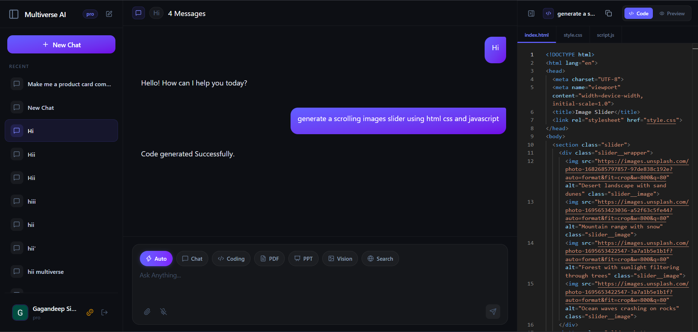
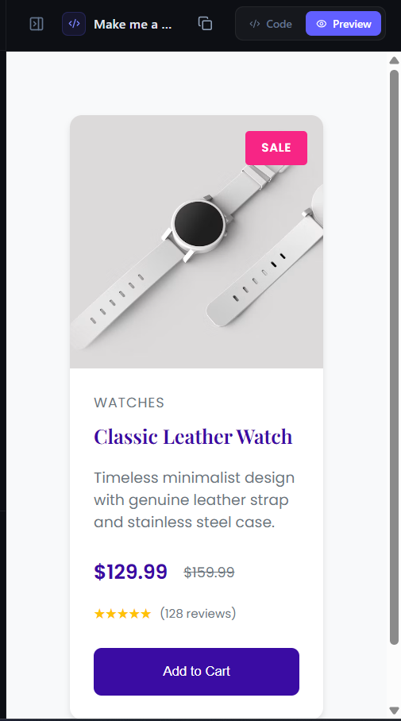

<div align="center">

# 🌌 Multiverse AI

### One platform. Every AI superpower.

A full-stack AI workspace like ChatGPT — but combined with document generation, image creation, real-time web search, and an autonomous coding agent, all in a single seamless experience.

[](https://nextjs.org/)
[](https://nodejs.org/)
[](./LICENSE)
[](#contributing)

[Live Demo](https://multiverseai-self.vercel.app/) · [Report Bug](#) · [Request Feature](#)

</div>

---

## ✨ Overview

**Multiverse AI** brings together the tools people usually need five different apps for — chat, document creation, image generation, web search, and coding help — into one unified, ChatGPT-style interface. Instead of switching tabs, users switch *modes* within the same conversation.

## 🚀 Features

- 💬 **Conversational AI Chat** — ChatGPT-style interface with context-aware, multi-turn conversations
- 📊 **PPT Generator** — Turn a prompt or outline into a ready-to-download presentation
- 📄 **PDF Generator** — Generate structured, styled PDF documents from text or data
- 🎨 **Image Generator** — Create AI-generated images from natural language prompts
- 🔎 **Web Search** — Real-time, up-to-date answers pulled live from the web
- 🤖 **Coding Agent** — An autonomous agent that can write, explain, and debug code
- 🔐 **Secure Authentication** — Protected user sessions and API access
- 💳 **Billing** — Subscription/payment handling (🧪 currently in test mode — no live transactions yet)
- ⚡ **Fast & Responsive UI** — Built with Next.js for a smooth, modern experience

## 🖼️ Screenshots

<div align="center">

**Dashboard**


**Artifact / Generation View**


**Billing (Test Mode)**


</div>

## 🛠️ Tech Stack

| Layer | Technology |
|---|---|
| **Frontend** | React / Next.js |
| **Backend** | Node.js / Express — Microservices architecture |
| **Database** | *(e.g. MongoDB / PostgreSQL — update this)* |
| **AI/LLM Integration** | *(e.g. OpenAI API / Anthropic API — update this)* |
| **Image Generation** | *(e.g. DALL·E / Stable Diffusion API — update this)* |
| **Deployment** | Vercel |

## 🧩 Architecture

Multiverse AI's backend follows a **microservices architecture**, fronted by a single API Gateway that routes requests to independent services.

```
                        ┌────────────────────┐
                        │   Next.js Frontend  │
                        └──────────┬──────────┘
                                   │
                                   ▼
                        ┌────────────────────┐
                        │    API Gateway      │
                        └──────────┬──────────┘
                                   │
        ┌───────────────┬─────────┴─────────┬───────────────┐
        ▼               ▼                   ▼               ▼
┌───────────────┐┌───────────────┐┌───────────────┐┌───────────────┐
│  Auth Service ││ Chat Service  ││ Agent Service ││ Billing Service│
│               ││               ││ (coding agent,││  🧪 Test Mode  │
│  Login/JWT/   ││ Chat, PPT,    ││  web search,  ││  (not live yet)│
│  Sessions     ││ PDF, image    ││  automation)  ││                │
│               ││ generation    ││               ││                │
└───────────────┘└───────────────┘└───────────────┘└───────────────┘
```

- **API Gateway** — single entry point for the frontend; handles routing, and can also manage cross-cutting concerns like rate limiting and auth verification
- **Auth Service** — user registration, login, JWT issuance/verification, session management
- **Chat Service** — core conversational AI, plus PPT/PDF/image generation and web search
- **Agent Service** — the autonomous coding agent and related tool-use workflows
- **Billing Service** — subscription/payment handling — ⚠️ **currently in test mode**, not yet processing real transactions

Each service can be developed, deployed, and scaled independently.

## 📂 Project Structure

```
multiverse-ai/
├── frontend/                  # Next.js client application
│   ├── components/
│   ├── pages/ or app/
│   ├── public/
│   └── package.json
├── backend/
│   ├── gateway/                # API Gateway — routes requests to services
│   ├── services/
│   │   ├── auth-service/        # Authentication & session management
│   │   ├── chat-service/        # Chat, PPT/PDF/image generation, web search
│   │   ├── agent-service/       # Coding agent
│   │   └── billing-service/     # Billing (🧪 test mode)
│   └── package.json
├── .gitignore
└── README.md
```

## 🌐 Live Demo

👉 **[https://multiverseai-self.vercel.app/](https://multiverseai-self.vercel.app/)**

## ⚙️ Getting Started

### Prerequisites

- Node.js (v18+ recommended)
- npm or yarn
- API keys for the AI/services you're integrating (see [Environment Variables](#-environment-variables))

### Installation

1. **Clone the repository**
   ```bash
   git clone https://github.com/your-username/multiverse-ai.git
   cd multiverse-ai
   ```

2. **Install frontend dependencies**
   ```bash
   cd frontend
   npm install
   ```

3. **Install dependencies for each backend service**
   ```bash
   cd backend/gateway && npm install
   cd ../services/auth-service && npm install
   cd ../chat-service && npm install
   cd ../agent-service && npm install
   cd ../billing-service && npm install
   ```

4. **Set up environment variables**

   Create a `.env` file in the `frontend/` directory, and one in each backend service directory (gateway + each of the four services) — see below.

5. **Run the services**

   Each service runs independently, so start them each in their own terminal (or use a process manager / `docker-compose` — see [Roadmap](#-roadmap)):

   ```bash
   # Gateway
   cd backend/gateway && npm run dev

   # Auth service
   cd backend/services/auth-service && npm run dev

   # Chat service
   cd backend/services/chat-service && npm run dev

   # Agent service
   cd backend/services/agent-service && npm run dev

   # Billing service (test mode)
   cd backend/services/billing-service && npm run dev
   ```

   Frontend:
   ```bash
   cd frontend
   npm run dev
   ```

6. Open [http://localhost:3000](http://localhost:3000) to view the app. The frontend talks only to the **API Gateway**, which routes to the appropriate service.

## 🔑 Environment Variables

> ⚠️ Never commit your `.env` files. Each service directory and the frontend should have its own `.env`, and **all** of them must be listed in `.gitignore`.

**Gateway `.env`**
```env
PORT=5000
AUTH_SERVICE_URL=http://localhost:5001
CHAT_SERVICE_URL=http://localhost:5002
AGENT_SERVICE_URL=http://localhost:5003
BILLING_SERVICE_URL=http://localhost:5004
```

**Auth Service `.env`**
```env
PORT=5001
DATABASE_URL=your_database_connection_string
JWT_SECRET=your_jwt_secret
```

**Chat Service `.env`**
```env
PORT=5002
DATABASE_URL=your_database_connection_string
AI_API_KEY=your_ai_provider_api_key
IMAGE_GEN_API_KEY=your_image_api_key
SEARCH_API_KEY=your_web_search_api_key
```

**Agent Service `.env`**
```env
PORT=5003
AI_API_KEY=your_ai_provider_api_key
```

**Billing Service `.env`** — 🧪 *test mode*
```env
PORT=5004
BILLING_PROVIDER_MODE=test
BILLING_PROVIDER_TEST_KEY=your_test_mode_api_key
```
> Billing is currently running against a test/sandbox key only. No real transactions are processed yet — switch `BILLING_PROVIDER_MODE` to `live` and swap in production keys once ready to go live.

**Frontend `.env`**
```env
NEXT_PUBLIC_API_BASE_URL=http://localhost:5000
NEXT_PUBLIC_APP_NAME=Multiverse AI
```

## 🧭 Roadmap

- [ ] Move billing service from test mode to live payments
- [ ] Docker Compose setup to spin up gateway + all services together
- [ ] Voice input/output support
- [ ] Multi-user collaboration on documents
- [ ] Plugin system for custom AI tools
- [ ] Mobile app version

## 🤝 Contributing

Contributions are welcome!

1. Fork the project
2. Create your feature branch (`git checkout -b feature/amazing-feature`)
3. Commit your changes (`git commit -m 'Add some amazing feature'`)
4. Push to the branch (`git push origin feature/amazing-feature`)
5. Open a Pull Request

## 📄 License

Distributed under the MIT License. See `LICENSE` for more information.

## 📬 Contact

**Your Name** — your.email@example.com

Project Link: [https://github.com/your-username/multiverse-ai](https://github.com/your-username/multiverse-ai)

---

<div align="center">
Made with ❤️ and a lot of AI models
</div>
