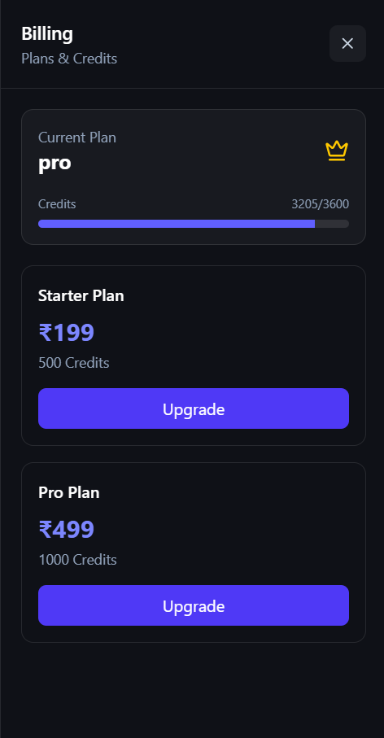

<div align="center">

# 🌌 Multiverse AI

### One platform. Every AI superpower.

A full-stack AI workspace called MultiverseAI — but combined with document generation, image creation, real-time web search, document intelligence (RAG), and an autonomous coding agent, all in a single seamless experience.

[](https://reactjs.org/)
[](https://nodejs.org/)
[](./LICENSE)
[](#contributing)

[Live Demo](https://multiverseai-self.vercel.app/)

</div>

---

## ✨ Overview

**Multiverse AI** brings together the tools people usually need five different apps for — chat, document generation, image creation, web search, document intelligence, and coding help — into one unified, ChatGPT-style interface. Instead of switching tabs, users switch *modes* within the same conversation.

With the addition of **Retrieval-Augmented Generation (RAG)**, users can now upload their own documents and get grounded, context-aware answers drawn directly from that content via semantic search — instead of relying on the model's general knowledge alone.

## 🚀 Features

- 💬 **Conversational AI Chat** — ChatGPT-style interface with context-aware, multi-turn conversations
- 📊 **PPT Generator** — Turn a prompt or outline into a ready-to-download presentation
- 📄 **PDF Generator** — Generate structured, styled PDF documents from text or data
- 🎨 **Image Generator** — Create AI-generated images from natural language prompts
- 🔎 **Web Search** — Real-time, up-to-date answers pulled live from the web
- 📚 **RAG / Document Intelligence** — Upload documents, get them parsed and chunked, embedded, and stored in a vector database for accurate semantic search and grounded Q&A
- 🤖 **Coding Agent** — An autonomous agent that can write, explain, and debug code
- 🔐 **Secure Authentication** — Protected user sessions and API access
- 💳 **Billing** — Subscription/payment handling via Razorpay (🧪 currently in test mode — no live transactions yet)
- ⚡ **Fast & Responsive UI** — Built with React for a smooth, modern experience

## 🖼️ Screenshots

<table>
  <tr>
    <td align="center" colspan="2">
      
      <p align="center"><b>Dashboard</b></p>
    </td>
  </tr>
  <tr>
    <td align="center" width="50%">
      
      <p align="center"><b>Artifact / Generation View</b></p>
    </td>
    <td align="center" width="50%">
      
      <p align="center"><b>Billing (Test Mode)</b></p>
    </td>
  </tr>
</table>

## 🛠️ Tech Stack

| Layer | Technology |
|---|---|
| **Frontend** | React |
| **Backend** | Node.js / Express — Microservices architecture |
| **Database** | MongoDB |
| **Cache / Queue** | Redis (Upstash) |
| **AI/LLM Integration** | OpenAI API / Groq API / OpenRouter API |
| **Web Search** | Tavily API |
| **Document Parsing** | pdf-parse  |
| **Embeddings** | LangChain Vector Embeddings|
| **Vector DB** | Qdrant (semantic search / RAG retrieval) |
| **File Storage** | AWS S3 |
| **Payments** | Razorpay (test mode) |
| **Deployment** | Vercel / Render |

## 🧩 Architecture

Multiverse AI's backend follows a **microservices architecture**, fronted by a single API Gateway that routes requests to independent services.

```
                    ┌────────────────────┐
                    │   React.js Frontend │
                    └──────────┬──────────┘
                               │
                               ▼
                      ┌────────────────────┐
                      │    API Gateway      │
                      └──────────┬──────────┘
                                 │
      ┌───────────────┬─────────┴─────────┬───────────────┐
      ▼               ▼                   ▼               ▼
┌───────────────┐┌───────────────┐┌────────────────────────┐┌───────────────┐
│  Auth Service ││ Chat Service  ││    Agent Service        ││ Billing Service│
│               ││               ││ (coding agent, web      ││ 🧪 Test Mode  │
│  Login/JWT/   ││ Chat,         ││  search, chat agent,    ││  (not live yet)│
│  Sessions     ││ conversation  ││  ppt/pdf agent, RAG:     ││                │
│               ││               ││  parse → chunk → embed  ││                │
│               ││               ││  → Qdrant → retrieve)   ││                │
└───────────────┘└───────────────┘└────────────┬────────────┘└───────────────┘
                                                │
                                                ▼
                                     ┌────────────────────┐
                                     │   Qdrant Vector DB  │
                                     │  (document chunks + │
                                     │   embeddings store) │
                                     └────────────────────┘
```

- **API Gateway** — single entry point for the frontend; handles routing, and can also manage cross-cutting concerns like rate limiting and auth verification
- **Auth Service** — user registration, login, JWT issuance/verification, session management
- **Chat Service** — core conversational AI, plus PPT/PDF/image generation and web search
- **Agent Service** — the autonomous coding agent, RAG pipeline, and related tool-use workflows (Groq, Google, OpenRouter LLMs, Tavily web search, Qdrant vector search, S3 file storage)
- **Billing Service** — subscription/payment handling via Razorpay — ⚠️ **currently in test mode**, not yet processing real transactions

Each service can be developed, deployed, and scaled independently, and communicate through Redis (Upstash) for caching/shared state.

## 📚 RAG / Document Intelligence

Multiverse AI supports **Retrieval-Augmented Generation**, letting users upload their own documents and query them with grounded, source-aware answers instead of relying solely on the LLM's parametric knowledge.

**Pipeline:**

1. **Upload** — User uploads a document (PDF, DOCX, TXT) through the frontend; the file is stored in **AWS S3** and a reference is saved in MongoDB.
2. **Parse** — The Agent Service extracts raw text from the document, handling different file formats.
3. **Chunk** — Extracted text is split into overlapping chunks sized for the embedding model, preserving semantic continuity across chunk boundaries.
4. **Embed** — Each chunk is converted into a vector embedding via the HuggingFace / Google embedding API.
5. **Store** — Embeddings, along with metadata (document ID, chunk text, page/section reference), are upserted into **Qdrant**.
6. **Retrieve** — On a user query, the query is embedded the same way, and Qdrant performs a similarity search to fetch the most relevant chunks.
7. **Generate** — Retrieved chunks are injected into the LLM prompt as context, and the model generates an answer grounded in the uploaded document rather than general knowledge alone.

This enables use cases like:
- Asking questions directly about an uploaded report, contract, or research paper
- Summarizing long documents accurately without hallucination
- Cross-referencing multiple uploaded documents in a single conversation

> 🧭 Chunking strategy, embedding model, and top-k retrieval settings are configurable in the Agent Service and can be tuned for accuracy vs. latency trade-offs.

## 📂 Project Structure

```
multiverse-ai/
├── frontend/                  # React client application
│   ├── components/
│   ├── pages/ or app/
│   ├── public/
│   └── package.json
├── backend/
│   ├── gateway/                # API Gateway — routes requests to services
│   ├── services/
│   │   ├── auth-service/        # Authentication
│   │   ├── chat-service/        # Chat, Conversation
│   │   ├── agent-service/       # Coding, Chat, ppt, pdf, web search agent + RAG pipeline
│   │   │   ├── rag/             # Document parsing, chunking, embedding, retrieval
│   │   └── billing-service/     # Billing via Razorpay (🧪 test mode)
│   └── package.json
├── .gitignore
└── README.md
```

## 🌐 Live Demo

👉 **[https://multiverseai-self.vercel.app/](https://multiverseai-self.vercel.app/)**

## ⚙️ Getting Started

### Prerequisites

- Node.js (v18+ recommended)
- npm or yarn
- API keys for the AI/services you're integrating (see [Environment Variables](#-environment-variables))

### Installation

1. **Clone the repository**
   ```bash
   git clone https://github.com/your-username/multiverse-ai.git
   cd multiverse-ai
   ```

2. **Install frontend dependencies**
   ```bash
   cd frontend
   npm install
   ```

3. **Install dependencies for each backend service**
   ```bash
   cd backend/gateway && npm install
   cd ../services/auth-service && npm install
   cd ../chat-service && npm install
   cd ../agent-service && npm install
   cd ../billing-service && npm install
   ```

4. **Set up environment variables**

   Create a `.env` file in the `frontend/` directory, and one in each backend service directory (gateway + each of the four services) — see below.

5. **Run the services**

   Each service runs independently, so start them each in their own terminal (or use a process manager / `docker-compose` — see [Roadmap](#-roadmap)):

   ```bash
   # Gateway
   cd backend/gateway && npm run dev

   # Auth service
   cd backend/services/auth-service && npm run dev

   # Chat service
   cd backend/services/chat-service && npm run dev

   # Agent service (includes RAG pipeline)
   cd backend/services/agent-service && npm run dev

   # Billing service (test mode)
   cd backend/services/billing-service && npm run dev
   ```

   Frontend:
   ```bash
   cd frontend
   npm run dev
   ```

6. Open [http://localhost:3000](http://localhost:3000) to view the app. The frontend talks only to the **API Gateway**, which routes to the appropriate service.

## 🔑 Environment Variables

> ⚠️ Never commit your `.env` files. Each service directory and the frontend should have its own `.env`, and **all** of them must be listed in `.gitignore`.

**Gateway `.env`**
```env
PORT=8000
AUTH_SERVICE_URL=
CHAT_SERVICE_URL=
AGENT_SERVICE_URL=
BILLING_SERVICE_URL=
FRONTEND_URL=
UPSTASH_REDIS_REST_URL=
UPSTASH_REDIS_REST_TOKEN=
REDIS_URL=
```

**Auth Service `.env`**
```env
MONGODB_URI=
PORT=8001
UPSTASH_REDIS_REST_URL=
UPSTASH_REDIS_REST_TOKEN=
REDIS_URL=
```

**Chat Service `.env`**
```env
MONGODB_URI=
PORT=8002
UPSTASH_REDIS_REST_URL=
UPSTASH_REDIS_REST_TOKEN=
REDIS_URL=
```

**Agent Service `.env`** — includes RAG pipeline config
```env
MONGODB_URI=
PORT=8003
GROQ_API_KEY=
GOOGLE_API_KEY=
AUTH_SERVICE=
CHAT_SERVICE=
TAVILY_API_KEY=
OPENROUTER_API_KEY=
AWS_REGION=
AWS_ACCESS_KEY_ID=
AWS_SECRET_KEY=
AWS_BUCKET_NAME=
POLLEN_API_KEY=
HF_API_KEY=
QDRANT_API_KEY=
QDRANT_URL=
QDRANT_COLLECTION_NAME=
EMBEDDING_MODEL=
CHUNK_SIZE=
CHUNK_OVERLAP=
RETRIEVAL_TOP_K=
UPSTASH_REDIS_REST_URL=
UPSTASH_REDIS_REST_TOKEN=
REDIS_URL=
```

**Billing Service `.env`** — 🧪 *test mode*
```env
MONGODB_URI=
PORT=8004
RAZORPAY_KEY_ID=
RAZORPAY_KEY_SECRET=
AUTH_SERVICE=
```
> Billing is currently running against Razorpay's test/sandbox keys only. No real transactions are processed yet — swap in Razorpay live keys once ready to go live.

**Frontend `.env`**
```env
VITE_API_BASE_URL=
VITE_APP_NAME=Multiverse AI
```

## 🧭 Roadmap

- [ ] Move billing service from test mode to live payments
- [ ] Docker Compose setup to spin up gateway + all services together
- [ ] Multi-document RAG with cross-document citation
- [ ] Voice input/output support
- [ ] Multi-user collaboration on documents
- [ ] Plugin system for custom AI tools
- [ ] Mobile app version

## 🤝 Contributing

Contributions are welcome!

1. Fork the project
2. Create your feature branch (`git checkout -b feature/amazing-feature`)
3. Commit your changes (`git commit -m 'Add some amazing feature'`)
4. Push to the branch (`git push origin feature/amazing-feature`)
5. Open a Pull Request

## 📄 License

Distributed under the MIT License. See `LICENSE` for more information.

## 📬 Contact

**Your Name** — deep8686385@gmail.com

Project Link: [https://github.com/deep23232323/Ai_project](https://github.com/deep23232323/Ai_project)

---

<div align="center">
Made with ❤️ and a lot of AI models
</div>
